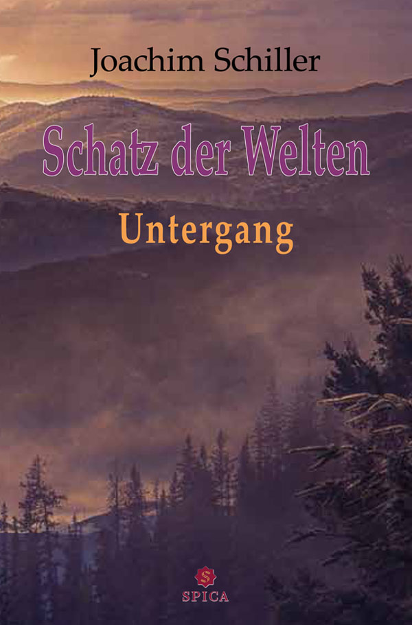

# Der Schatz der Welten: Untergang

by Joachim Schiller

In a world where ancient elven kingdoms lie shattered beneath human cities, a young cartographer's apprentice stumbles upon a map that should not exist – one that leads to the legendary Schatz der Welten, a relic said to hold the memories of all lost civilisations. But dark forces have been watching the map for centuries, and the apprentice's discovery sets off a chain of events that will reshape the fate of three realms.

## 1. Downfall

The Durabor is overtaken by its past. Dark powers, which hid in the shadows for decades, return to the world with renewed strength, seeking to seize everything for themselves. The plans of the mage Ephnies soon bring devastation upon the Great Forest and greedily stretch into the neighboring realm of Norskom, which must face both its own internal struggles and the approaching storm.

Troubled by these events, a handful of brave adventurers set out to put an end to the dark peril with the help of this kingdom. However, none of them could have foreseen what awaited them in the distance. A story full of betrayal and ambush unfolds before their eyes…

## 2. Norskom's Revenge

The mountain realm of Norskom longs for a semblance of peace. But as the brave heroes return to their homeland, the true destruction left behind by evil is revealed: dangerous creatures still roam the Durabor, soon separating the adventurers from one another. Yet, far more menacing is the flaring thirst for revenge among men.

It soon becomes clear that far more slumbers behind the facade of peace than the dearly won freedom: the greedy god of war, Mardok, plunges the worlds into unstoppable chaos—appearing not only to orchestrate the downfall of humanity in Norskom but also inciting unrest in the realm of the elves. The gathering danger soon presents Norskom with new challenges and raises enigmatic questions; the search for answers drives humanity as far as the distant Valley of the Giants and the hideous gloom of the Underworld…

## 3. The Fallen Elves

With the ruins of the Underworld before them, the gods hope for a newfound security. But their struggle is far from over, for new dangers rise from the unleashed darkness to threaten the realm of the elves. The people of the Fallen Elves appear more powerful than ever. Meanwhile, the ruler of the Underworld, driven by angry grief for his former home, carves his path toward a long-awaited omnipotence. Simultaneously, the war god Mardok watches as his plans for the Durabor fall into place: humanity shattered, the realm of Norskom plunged into chaos, and peace an unreachable dream.

In the face of all these challenges, even the hope of mankind begins to waver. Can Norskom be saved from the bloodlust of the dark mage of the Underworld and the Fallen Elves? Or will the war god Mardok plunge the Durabor into damnation with renewed cruelty?
